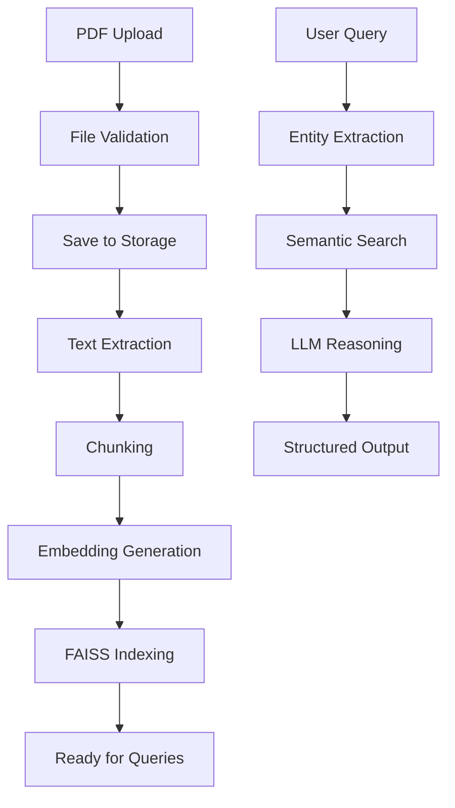

# 🧠 Enhanced ClauseMind – Intelligent Clause Retriever & Decision System

## ✨ What's New in Enhanced Version

The enhanced ClauseMind now includes **full PDF upload functionality** with drag & drop interface, automatic embedding generation, and real-time FAISS indexing - perfect for hackathon demos!

### 🆕 Enhanced Features

- **🎯 Drag & Drop PDF Upload** - Modern web interface with visual feedback
- **⚡ Auto Indexing** - Automatic embedding generation and FAISS indexing
- **🔄 Real-time Processing** - Background processing for large documents
- **📁 File Management** - Upload, list, and delete documents
- **🎨 Enhanced UI** - Beautiful, responsive interface with progress indicators
- **🔍 Live Status** - Real-time system health and document count

## 🚀 Quick Start (Enhanced)

### 1. Install Dependencies
```bash
pip install -r requirements.txt
```

### 2. Get Gemini API Key
- Visit [Google AI Studio](https://makersuite.google.com/app/apikey)
- Create a new API key
- Add it to `.env` file

### 3. Run Enhanced System
```bash
python start_enhanced.py
```

### 4. Access Enhanced Interface
- **Enhanced Web UI**: http://localhost:8000/frontend/enhanced.html
- **API Documentation**: http://localhost:8000/docs
- **Health Check**: http://localhost:8000/api/v1/health

## 🎯 Enhanced Workflow

### Step 1: Upload PDF Documents
1. Open the enhanced web interface
2. Drag & drop PDF files or click to browse
3. Watch real-time progress as documents are processed
4. Automatic embedding generation and FAISS indexing

### Step 2: Query the System
1. Enter natural language queries
2. System extracts entities and retrieves relevant clauses
3. LLM reasoning provides decisions with justifications
4. View detailed results with referenced clauses

## 📋 Enhanced API Endpoints

### Document Upload
```http
POST /api/v1/upload_pdf
Content-Type: multipart/form-data
```

**Response:**
```json
{
  "status": "uploaded",
  "message": "Document uploaded and indexed successfully",
  "filename": "insurance_policy.pdf",
  "chunks_indexed": 23,
  "total_documents": 45,
  "file_info": {
    "filename": "uuid_insurance_policy.pdf",
    "size": 2048576,
    "created": 1703123456.789,
    "path": "data/uploads/uuid_insurance_policy.pdf"
  }
}
```

### Background Upload
```http
POST /api/v1/upload_pdf_async
Content-Type: multipart/form-data
```

### File Management
```http
GET /api/v1/uploaded_files          # List uploaded files
DELETE /api/v1/uploaded_files/{filename}  # Delete file
POST /api/v1/cleanup_files          # Cleanup old files
```

### Query Processing
```http
POST /api/v1/query
Content-Type: application/json

{
  "query": "46M, knee surgery, Pune, 3-month policy",
  "top_k": 5
}
```

## 🏗️ Enhanced Architecture



## 🛠️ Enhanced Tech Stack

| Component | Technology | Purpose |
|-----------|------------|---------|
| **Backend** | FastAPI | Async API with file upload |
| **File Handling** | aiofiles | Async file operations |
| **Upload UI** | HTML5 Drag & Drop | Modern file upload |
| **Embeddings** | SentenceTransformers | Text embedding generation |
| **Vector DB** | FAISS | Fast similarity search |
| **LLM** | Google Gemini | Reasoning and entity extraction |
| **Document Processing** | PyPDF2 | PDF text extraction |
| **Storage** | Local File System | Document persistence |

## 📁 Enhanced Project Structure

```
clause-mind/
├── app/
│   ├── main.py                    # FastAPI app with static files
│   ├── routes/
│   │   ├── query_router.py        # Query processing
│   │   └── upload_router.py       # Enhanced upload functionality
│   └── utils/
│       ├── pdf_loader.py          # PDF processing
│       ├── pdf_utils.py           # File handling utilities
│       ├── embeddings.py          # Embedding generation
│       ├── vectorstore.py         # FAISS operations
│       └── llm_reasoner.py        # LLM reasoning
├── frontend/
│   ├── index.html                 # Basic interface
│   └── enhanced.html              # Enhanced interface with drag & drop
├── data/
│   └── uploads/                   # Uploaded PDF storage
├── config.py                      # Configuration
├── requirements.txt               # Dependencies
├── start_enhanced.py             # Enhanced startup script
└── README_ENHANCED.md            # This file
```

## 🎨 Enhanced UI Features

### Drag & Drop Upload
- Visual feedback during drag operations
- File type validation
- Progress indicators
- Error handling

### Real-time Status
- System health monitoring
- Document count tracking
- File management interface
- Upload progress visualization

### Query Interface
- Natural language input
- Entity extraction display
- Decision visualization
- Referenced clauses highlighting
- JSON response viewer

## 🔧 Configuration

### Environment Variables
```env
GEMINI_API_KEY=your_gemini_api_key_here
MODEL_NAME=gemini-pro
EMBEDDING_MODEL=all-MiniLM-L6-v2
CHUNK_SIZE=1000
CHUNK_OVERLAP=200
TOP_K_RETRIEVAL=5
```

### File Upload Settings
- **Max File Size**: 50MB
- **Supported Format**: PDF only
- **Storage Location**: `data/uploads/`
- **Auto Cleanup**: 24 hours (configurable)

## 🧪 Testing Enhanced Features

### Manual Testing
```bash
# Start the enhanced system
python start_enhanced.py

# Test upload via curl
curl -X POST "http://localhost:8000/api/v1/upload_pdf" \
     -F "file=@your_insurance_policy.pdf"

# Test query
curl -X POST "http://localhost:8000/api/v1/query" \
     -H "Content-Type: application/json" \
     -d '{"query": "What is covered for knee surgery?"}'
```

### Web Interface Testing
1. Open http://localhost:8000/frontend/enhanced.html
2. Drag & drop a PDF file
3. Wait for processing to complete
4. Enter a query and see results

## 🚀 Deployment

### Local Development
```bash
python start_enhanced.py
```

### Production (Gunicorn)
```bash
pip install gunicorn
gunicorn app.main:app -w 4 -k uvicorn.workers.UvicornWorker
```

### Docker
```dockerfile
FROM python:3.9-slim
WORKDIR /app
COPY requirements.txt .
RUN pip install -r requirements.txt
COPY . .
RUN mkdir -p data/uploads
CMD ["python", "start_enhanced.py"]
```

## 🔒 Security Considerations

- **File Validation**: Type and size checking
- **Path Sanitization**: Secure file handling
- **API Key Management**: Environment variable storage
- **CORS Configuration**: Production-ready settings
- **Rate Limiting**: Implement for production use

## 🎯 Hackathon Demo Tips

### Perfect Demo Flow
1. **Start with empty system** - Show "0 documents"
2. **Upload a PDF** - Demonstrate drag & drop
3. **Show processing** - Real-time progress
4. **Query the system** - Natural language input
5. **Display results** - Highlight decision and justification
6. **Upload more documents** - Show scalability
7. **Complex queries** - Demonstrate intelligence

### Demo Script
```
"Welcome to ClauseMind! Let me show you how it works:

1. First, I'll upload an insurance policy PDF [drag & drop]
2. Watch as it automatically processes and indexes the document
3. Now I can ask questions in natural language
4. The system finds relevant clauses and provides decisions
5. Let me try a few different queries to show its capabilities"
```

## 🆘 Support & Troubleshooting

### Common Issues
- **Upload fails**: Check file size and format
- **API errors**: Verify Gemini API key
- **Slow processing**: Large documents may take time
- **Memory issues**: Reduce chunk size in config

### Getting Help
- Check API documentation at `/docs`
- Review health endpoint at `/api/v1/health`
- Check server logs for detailed errors

---

## 🎉 Ready for Your Hackathon!

The enhanced ClauseMind is now ready with:
- ✅ **Drag & Drop PDF Upload**
- ✅ **Automatic Embedding Generation**
- ✅ **Real-time FAISS Indexing**
- ✅ **Beautiful Web Interface**
- ✅ **Complete API Documentation**
- ✅ **Production-ready Code**

**Perfect for impressing judges and demonstrating AI capabilities!** 🚀

---

**Built with ❤️ using FastAPI, LangChain, and Google Gemini** 